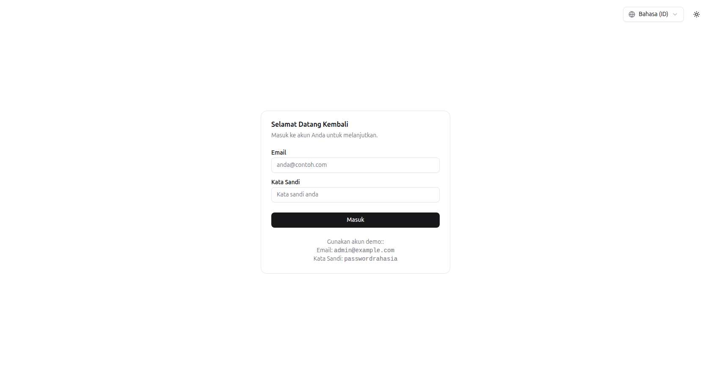
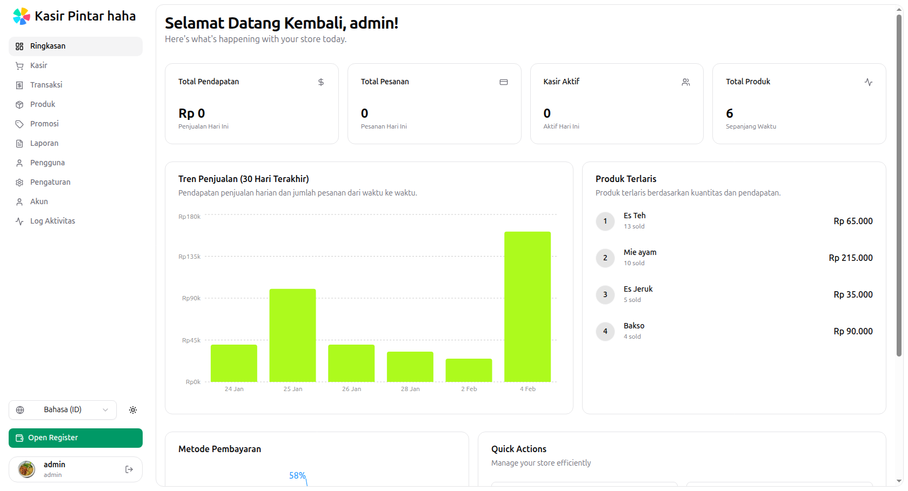
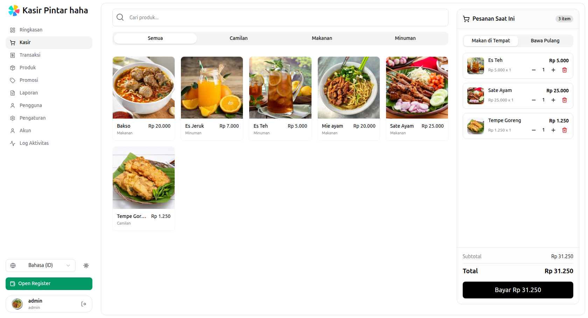
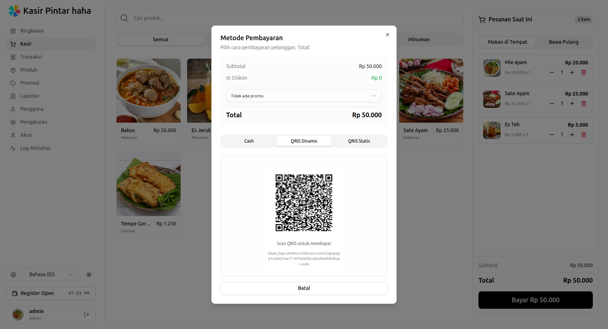
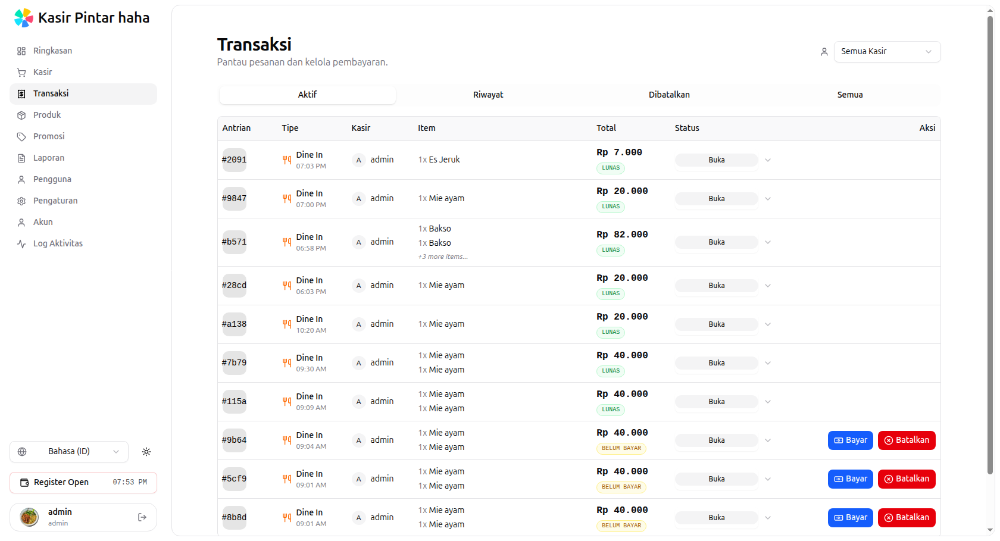
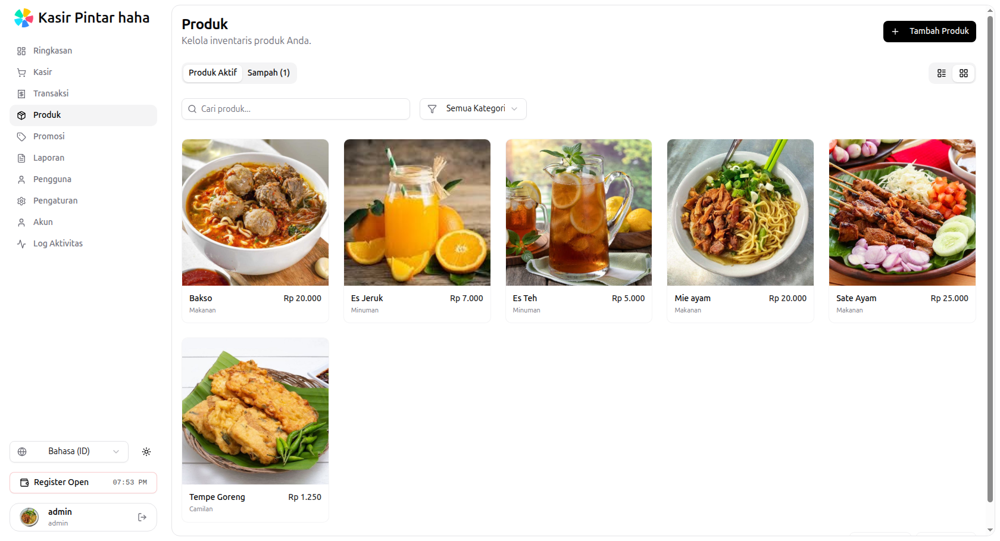
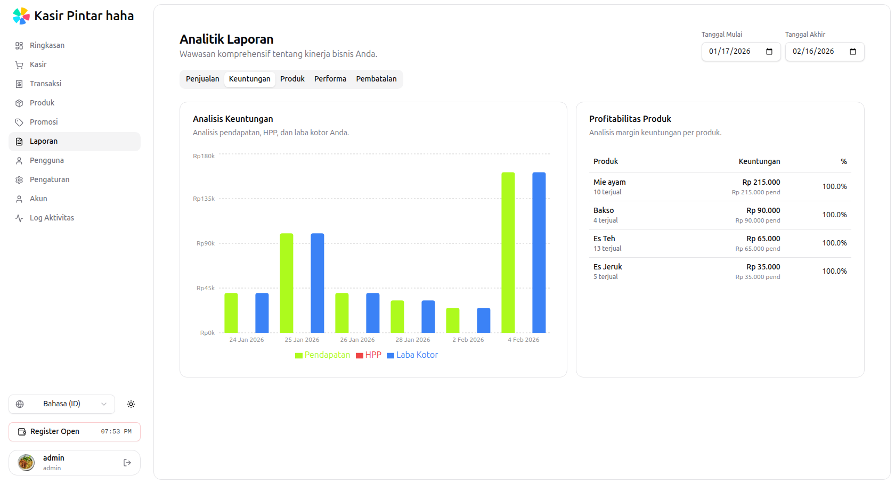
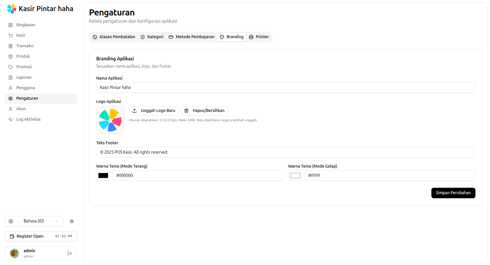

# **POS Fiplex (Point of Sales System)**


## Overview

**POS Fiplex** is a modern, high-performance Fullstack Point of Sales application designed to streamline retail operations. It provides a robust solution for managing products, processing orders, handling payments (including Digital Payments via Midtrans), and analyzing sales performance.

Built as a **single-port deployment** — the Go backend (`backend/`) serves both the REST API and the React SPA frontend (`frontend/`) on port `8080`.

## ✨ Key Features

| Category | Feature |
|----------|---------|
| **Auth & Access** | JWT authentication, backend-enforced RBAC with dynamic roles & granular permissions, session management |
| **Multi-tenancy** | Per-shop data isolation via `X-Shop-Id`; shops, roles & permission assignment managed in-app |
| **Inventory** | Products, categories, variants/options, stock history, image uploads, soft-delete & restore |
| **Orders** | Cart system, order workflow, operational status tracking, item updates |
| **Payments** | Manual cash/payment methods, Midtrans Payment Gateway (QRIS dynamic/static) |
| **Shift Management** | Cashier shift open/close, cash transactions, cash reconciliation |
| **Customers** | Customer registration and selection per order |
| **Promotions** | Percentage & fixed-amount discounts, scope (order/item), rules & targets |
| **Reports & Analytics** | Sales trends, product performance, cashier ranking, profit summary, payment distribution, low stock, shift summary |
| **Thermal Printing** | ESC/POS receipt printing, **auto network printer discovery** (TCP scan port 9100), Bluetooth support via Web Bluetooth |
| **Cloud Storage** | Cloudflare R2 / MinIO (S3-compatible) for product & variant images |
| **Activity Logging** | Complete audit trails with entity-level tracking |
| **Real-time Sync** | Global WebSocket Hub for instant cashier synchronization |
| **Redis Caching** | Cache-aside for optimized reporting performance |
| **Demo Maintenance**| Automated daily database reset (Wipe & Seed) at 01:00 AM |
| **Multi-language** | i18n support (English / Swahili) with `react-i18next` |
| **Theming** | Light / Dark / System mode |

## Tech Stack

### Backend

| Technology | Purpose |
|-----------|---------|
| **Go 1.25** + [Fiber v3](https://gofiber.io/) | HTTP framework |
| **PostgreSQL 15** + [sqlc](https://sqlc.dev/) | Type-safe SQL code generation |
| **Redis** | Rate limiting, shift caching, report performance (cache-aside) |
| **JWT** + RBAC middleware | Authentication & authorization |
| **WebSocket** | Real-time state synchronization |
| **Sentry** + `slog` | Structured logging & error tracking |
| **Swagger** (swaggo) | Auto-generated API documentation |
| **ESC/POS** (`pkg/escpos`) | Raw TCP thermal receipt printing |

### Frontend

| Technology | Purpose |
|-----------|---------|
| **React 19** + [TanStack Router](https://tanstack.com/router) | SPA with file-based routing |
| **Vite 7** + **Bun** | Build tool & package manager |
| **Tailwind CSS 4** + [shadcn/ui](https://ui.shadcn.com/) | UI component library |
| **TanStack Query** | Data fetching & caching |
| **OpenAPI Generator** | Typed API client from Swagger spec |
| **react-i18next** | Internationalization (EN/SW) |
| **Recharts** | Dashboard charts & analytics |
| **Web Bluetooth API** | Direct Bluetooth printer connectivity |

### Infrastructure

| Technology | Purpose |
|-----------|---------|
| **Docker** multi-stage build | Final image ~30MB Alpine |
| **GitHub Actions** CI/CD | Build → Push to GHCR → Deploy via Tailscale SSH |
| **MinIO** | S3-compatible object storage |
| **Redis** | Caching, rate limiting, and session state |
| **Sentry** | Production error & panic monitoring |

## Architecture

```
┌─────────────────────────────────────────────────┐
│              Go Backend :8080                    │
│                                                 │
│  /api/v1/*       → REST API                     │
│  /swagger/*      → API Docs                     │
│  /healthz        → Health Check                 │
│  /*              → React SPA (frontend/dist/)   │
└────────┬────────────────┬───────────────────────┘
         │                │
    ┌────┴────┐     ┌─────┴─────┐    ┌───────────┐
    │ Postgres │     │   Redis   │    │ MinIO/R2  │
    └─────────┘     └───────────┘    └───────────┘
```

```
Frontend (React SPA)
├── Network Printer  →  Backend TCP Socket  →  Printer :9100
└── Bluetooth Printer  →  Web Bluetooth API  →  BLE Printer
```

## 🚀 Quick Start (Docker)

Cara tercepat menjalankan seluruh aplikasi:

```bash
cd POS-FIPLEX/backend

# 1. Copy dan edit environment
cp .env.example .env
# Edit .env → isi DB_PASSWORD dan JWT_SECRET

# 2. Jalankan seluruh stack
docker compose up -d

# 3. Buka aplikasi
# App     → http://localhost:8080
# Swagger → http://localhost:8080/swagger/index.html
# MinIO   → http://localhost:9001
```

### Env yang WAJIB diisi:

| Variable | Keterangan |
|----------|-----------|
| `DB_PASSWORD` | Password PostgreSQL |
| `JWT_SECRET` | Secret key untuk token (`openssl rand -hex 32`) |

Env lainnya sudah memiliki default yang aman. Lihat [`.env.example`](.env.example) untuk daftar lengkap.

## 🛠️ Running Locally (Development)

This runs the **backend and the frontend dev server as two separate processes**. The
frontend dev server (`:5200`) proxies `/api`, `/swagger`, and `/healthz` to the backend
on **`:8700`** (see [`frontend/vite.config.ts`](frontend/vite.config.ts)), so the backend
must listen on port `8700` in this mode.

### ▶️ TL;DR — start both services

Run each block in its own terminal (first-time setup: do steps 1–2 below once first).

```bash
# 1) Backend  →  http://localhost:8700
cd backend
go run ./cmd/app

# 2) Frontend →  http://127.0.0.1:5200   (proxies the API to :8700)
cd frontend
bun run dev
```

**Log in** (login is by **email**) with a seeded demo account — run `make seed` in `backend/` once if you haven't:

| Username | Email (used to log in) | Password | Role |
|----------|------------------------|----------|------|
| `admin` | `admin@example.com` | `passwordrahasia` | admin (full access) |
| `manager` | `manager@example.com` | `passwordrahasia` | manager |
| `cashier` | `cashier@example.com` | `passwordrahasia` | cashier |

> These are **local demo credentials only** (public password, sample data). They exist only
> after `make seed`. Production uses its own admin created directly in the database — never
> commit live credentials to this repo.

Step-by-step details follow.

### Prerequisites

- **Go** 1.25+
- **Bun** (or Node.js 22+)
- **Docker** & Docker Compose — used to run PostgreSQL, Redis, and MinIO locally

Optional Go tools (only if you edit SQL or DTOs — install once with `go install`):

```bash
go install github.com/sqlc-dev/sqlc/cmd/sqlc@latest          # regenerate DB code (make sqlc-generate)
go install go.uber.org/mock/mockgen@latest                    # regenerate test mocks
go install github.com/air-verse/air@latest                    # backend hot-reload (optional)
go install -tags 'postgres' github.com/golang-migrate/migrate/v4/cmd/migrate@latest  # only if you run `make migrate-*` manually
```

### 1. Start infrastructure (Postgres + Redis + MinIO)

```bash
cd backend
make dev-infra        # or: docker compose -f docker-compose.infra.yml up -d
```

### 2. Configure the backend environment

```bash
cd backend
cp .env.example .env
```

Edit `.env` and set at least:

| Variable | Local value |
|----------|-------------|
| `APP_PORT` | `8700` — must match the frontend dev proxy target |
| `DB_HOST` | `localhost` |
| `DB_PASSWORD` | the password from `docker-compose.infra.yml` |
| `JWT_SECRET` | generate with `openssl rand -hex 32` |
| `AUTO_MIGRATE` | `true` — runs DB migrations automatically on startup |

### 3. Run the backend

```bash
cd backend
go run ./cmd/app       # or: air   (hot-reload)
```

The backend now listens on `http://localhost:8700`. With `AUTO_MIGRATE=true` the schema
(including the multi-tenancy/RBAC tables) is created on first boot, and the permission
catalog is seeded automatically.

### 4. Seed demo data & first login (local only)

There is no public sign-up endpoint — the first user must be seeded:

```bash
cd backend
make seed
```

This creates demo accounts you can log in with (login is by **email**):

| Email | Password | Role |
|-------|----------|------|
| `admin@example.com` | `passwordrahasia` | admin |
| `manager@example.com` | `passwordrahasia` | manager |
| `cashier@example.com` | `passwordrahasia` | cashier |

> ⚠️ **Demo credentials only.** `make seed` also inserts sample products/orders and uses a
> publicly-known password — never run it against production. On a real deployment, create the
> first admin directly in the database and set a strong password.

The `admin` role is the owner tier and bypasses fine-grained permission checks. Manager/cashier
(and any custom roles) are governed by the permissions assigned to their role under
**Roles & Permissions** in the UI. To exercise per-shop data isolation, create a shop under
**Shops**, choose **Set as Active Shop** (this sends the `X-Shop-Id` header), and assign users
to that shop.

### 5. Run the frontend dev server

```bash
cd frontend
bun install
bun run dev
```

Open **`http://127.0.0.1:5200`**. API calls are proxied to the backend on `:8700`.

### 6. (Optional) Single-port build

To serve the SPA directly from the Go backend (as in production):

```bash
cd frontend
bun run build          # outputs frontend/dist/
```

Then the backend serves the built SPA, the API, and Swagger from a single port.

> 💡 **Prefer one command?** From `backend/`, `docker compose up -d` builds and runs the whole
> stack (app + Postgres + Redis + MinIO) on `http://localhost:8080` — no separate frontend dev
> server needed. Use the two-process flow above only when actively developing the frontend.

## Useful Commands

```bash
# Database (jalankan dari folder backend/)
cd backend
make migrate-up          # Jalankan migrations
make migrate-down-one    # Rollback 1 migration
make migrate-create name=add_xxx_table   # Buat migration baru
make seed                # Seed sample data

# Code Generation
make sqlc-generate       # Generate Go code dari SQL
make swag                # Generate Swagger docs + API client

# Docker (dari folder backend/)
docker compose up -d              # Full stack (app + DB + MinIO)
docker compose -f docker-compose.infra.yml up -d   # Infra saja
```

## CI/CD

Pipeline berjalan via **GitHub Actions** dan dipicu dari setiap push/PR ke `master` atau tag semver `v*.*.*`.

| Trigger | Job | Keterangan |
|---------|-----|------------|
| Push/PR ke `master` | **test** | `go vet` (di `./backend`) dan build frontend (`bun run build` di `./frontend`) |
| Tag `v*.*.*` | **test** + **build-and-push** | Build dan push image ke GHCR dengan tag `X.Y.Z`, `X.Y`, dan `latest` |
| Tag `v*.*.*` | **deploy** | Koneksi ke VM lewat **Tailscale**, lalu `docker compose pull` + `docker compose up -d` di `/home/ubuntu` |

CI mengandalkan variabel berikut:

- `REGISTRY` (default `ghcr.io`) dan `IMAGE_NAME` (nama repository) untuk metadata Docker
- `TAILSCALE_AUTHKEY` untuk autentikasi Tailscale
- `VM_TAILSCALE_IP` dan `VM_SSH_PRIVATE_KEY` agar `appleboy/ssh-action` bisa mengakses host

## Project Structure

```
.
├── backend/              # Backend (Go + Fiber)
│   ├── cmd/
│   │   ├── app/          # Main server entry point
│   │   └── seeder/       # Database seeder
│   ├── config/           # Configuration loading
│   ├── internal/         # Business logic modules
│   │   ├── activitylog/      # Audit trail logging
│   │   ├── categories/       # Product category CRUD
│   │   ├── cancellation_reasons/ # Order cancellation reasons
│   │   ├── common/           # Shared middleware (auth, RBAC, rate limit, idempotency)
│   │   ├── customers/        # Customer management
│   │   ├── orders/           # Order processing & workflow
│   │   ├── payment_methods/  # Payment method CRUD
│   │   ├── printer/          # Thermal printing + network discovery
│   │   ├── products/         # Product CRUD, variants, stock, images
│   │   ├── promotions/       # Promotion engine (rules, targets, discounts)
│   │   ├── report/           # Sales, profit, performance analytics
│   │   ├── settings/         # App settings (branding, printer config)
│   │   ├── shift/            # Cashier shift management + cash reconcile
│   │   ├── user/             # User CRUD, auth, JWT, avatar
│   │   └── websocket/        # Real-time synchronization hub
│   ├── pkg/              # Shared packages
│   │   ├── cache/            # Redis cache abstraction
│   │   ├── cloudflare-r2/    # S3-compatible object storage
│   │   ├── database/         # PostgreSQL connection + migration runner
│   │   ├── escpos/           # ESC/POS printer protocol
│   │   ├── logger/           # Structured logging
│   │   ├── payment/          # Midtrans payment gateway
│   │   ├── utils/            # JWT manager, helpers
│   │   └── validator/        # Request validation
│   ├── server/
│   │   ├── server.go         # App init, DI container, lifecycle
│   │   ├── routes.go         # API route registration
│   │   └── frontend.go       # SPA static file serving
│   ├── sqlc/             # SQL queries, schema, migrations
│   └── Makefile          # Command shortcuts
├── frontend/             # Frontend (React SPA)
│   └── src/
│       ├── components/   # Feature-based component architecture
│       │   ├── account/        # Profile & security
│       │   ├── activity-logs/  # Activity log viewer
│       │   ├── auth/           # Login form
│       │   ├── common/         # Shared/reusable components
│       │   ├── customers/      # Customer management
│       │   ├── dashboard/      # Dashboard widgets & charts
│       │   ├── orders/         # POS cart, product search, variants
│       │   ├── payment/        # Payment dialogs
│       │   ├── products/       # Product table, grid, form, filters
│       │   ├── promotions/     # Promotion management
│       │   ├── reports/        # Analytics charts & tables
│       │   ├── settings/       # Branding, printer, categories
│       │   ├── transactions/   # Transaction history & actions
│       │   ├── users/          # User management
│       │   └── ui/             # shadcn/ui primitives
│       ├── lib/
│       │   ├── api/            # Generated API client + query hooks
│       │   ├── auth/           # RBAC utilities
│       │   ├── locales/        # i18n translations (en.json, sw.json)
│       │   └── printer/        # Frontend PrinterService (Bluetooth)
│       └── routes/             # TanStack Router file-based routes
└── README.md
```

> File `Dockerfile`, `docker-compose.yml`, `docker-compose.infra.yml`, dan `.env` berada di dalam `backend/`.

## 📸 Screenshots

| Login Page | Dashboard |
| :----: | :----: |
|  |  |

| Point of Sales (POS) | Payment & Checkout |
| :----: | :----: |
|  |  |

| Transaction History | Product Management |
| :----: | :----: |
|  |  |

| Reports & Analytics | Settings |
| :----: | :----: |
|  |  |

## API Documentation

Auto-generated Swagger documentation available at:

- **Local:** http://localhost:8080/swagger/index.html

## License

This project is licensed under the [MIT License](LICENSE).

## Author

**Agung Prasetyo**

- GitHub: https://github.com/agpprastyo
- LinkedIn: https://www.linkedin.com/in/agprastyo
- Portfolio: https://portfolio.agprastyo.me
